# Exercise 1 - Explore the data lake with Azure Synapse SQL On-demand and Azure Synapse Spark

In this exercise, you will explore data using the engine of your choice (SQL or Spark).

Understanding data through data exploration is one of the core challenges faced today by data engineers and data scientists as well. Depending on the underlying structure of the data as well as the specific requirements of the exploration process, different data processing engines will offer varying degrees of performance, complexity, and flexibility.

In Azure Synapse Analytics, you can use either the SQL Serverless engine, the big-data Spark engine, or both.

The tasks you will perform in this exercise are:

- Explore the Data Lake with SQL On-demand and Spark
  - Task 1 - Explore the Data Lake with Synapse SQL On-demand
  - Task 2 - Explore the Data Lake with Synapse Spark

## Task 1 - Explore the data lake with Azure Synapse SQL On-demand

In this task, you will browse your data lake using SQL On-demand.

1. In the **JumpVM** provided to you on the left side, double click on the **Azure Portal** browser shortcut on the desktop and login with the following credentials.

   * Azure Usename/Email: <inject key="AzureAdUserEmail"></inject> 
 
   * Azure Password: <inject key="AzureAdUserPassword"></inject>

   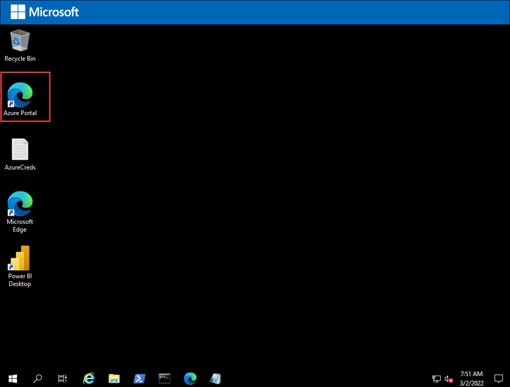
   
   > **Note**: If you are presented with **Help us protect your account** dialog box, then select **Skip for now** option.

     
   
2. In the Azure Portal, select **Resource groups**.

   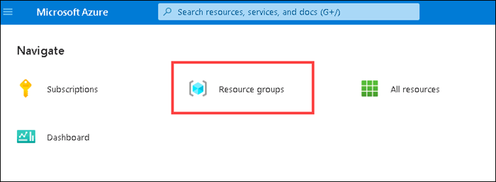

3. Select the **Synapse Analytics** resource group.

   

4. Select **SQLPool01** and **resume** it before starting the exercise.

   

   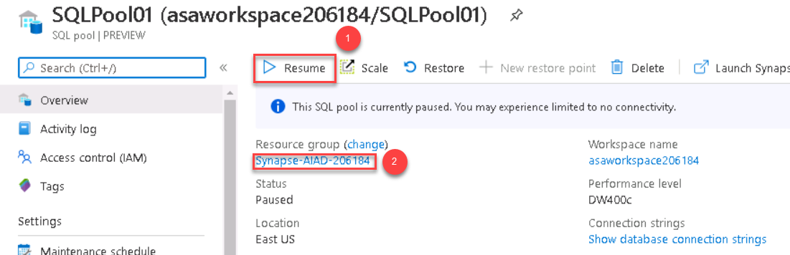
     
5. Return to the resource group, then select the **asadataexplorer<inject key="uniqueId" enableCopy="false"/>** and **start** it. 

   > **Note**: Please note starting of data explorer pool might take few minutes, you don't have to wait for it to be started you can proceed to next steps.

   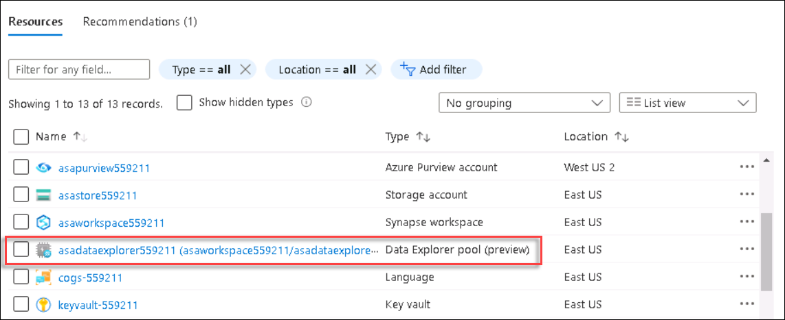
   
   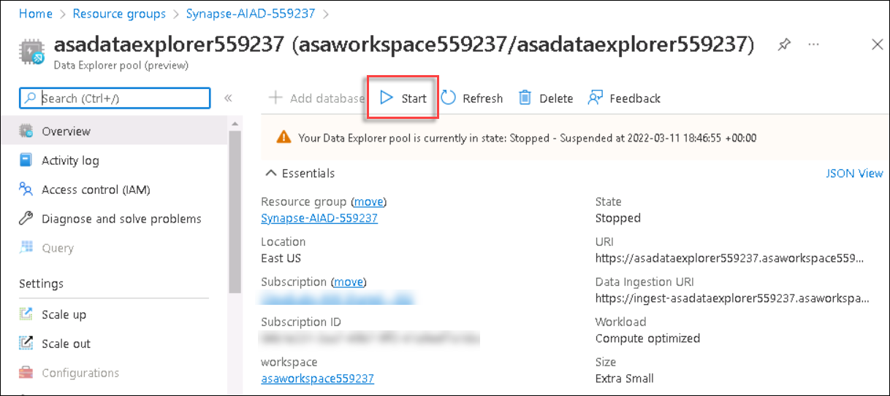
   
   >**Note**: In case the data explorer is in stopping state. Please continue with the lab as we need it in exercise 4. You can visit this page after few minutes and start it.

6. Return to the resource group, then select the **Synapse Analytics** workspace.

   

7. On the Synapse workspace blade, open Synapse Analytics Studio by navigating to the **Workspace web URL** from the overview page.

   > You can also Open synapse studio by clicking on **Open** under **Getting started->Open synapse studio**

   

8. In Synapse Analytics Studio, from the left panel click on the expand icon and navigate to the `Data` hub.

   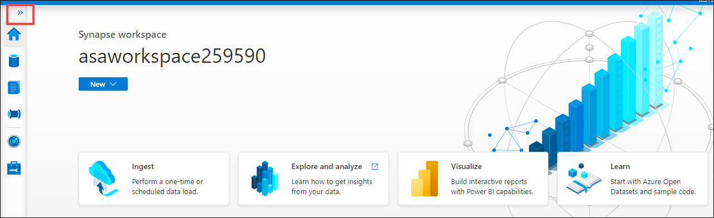

   

9. Switch to the `Linked` tab **(1)**. Under `Azure Data Lake Storage Gen2` **(2)**, expand the **asaworkspace<inject key="uniqueId" enableCopy="false"/>** primary data lake storage account **(3)**, and then select the `wwi` file system **(4)**.

   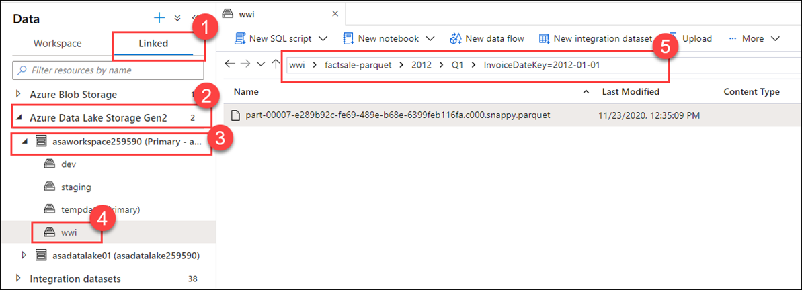

10. Inside the selected file system, double-click to navigate to `factsale-parquet` -> `2012` -> `Q1` -> `InvoiceDateKey=2012-01-01` **(5)**.

11. Once you are in `InvoiceDateKey=2012-01-01` right-click the Parquet file and select `New SQL script - Select TOP 100 rows`.

   > A script is automatically generated. Run this script to see how SQL on demand queries the file and returns the first 100 rows of that file with the header, allowing you to easily explore data in the file

   

12. Ensure the newly created script is connected to the `Built-in` pool and select `Run`. Data is loaded by the built-in SQL pool and processed as if it was coming from any regular relational database.

    

    > Note: SQL on demand is now named as **Built-in**

13. Let us change the initial script to load multiple Parquet files at once.

    - In line 2, replace `TOP 100 *` with `COUNT(*)`.
    - In line 5, replace the path to the individual file with

    ```python
    https://<yourdatalake storage account name>.dfs.core.windows.net/wwi/factsale-parquet/2012/Q1/*/*
    ```

    > Note: Replace 'yourdatalakestorageaccountname' with the <inject key="Storage Account Name"></inject>

14. Select `Run` to re-run the script. You should see a result of `2991716`, which is the number of records contained in all the Parquet files within the `factsale-parquet/2012/Q1` directory.

    

15. In Azure Synapse Analytics Studio, navigate to the `Develop` hub.

    

16. Expand **SQLScripts** and select the `Exercise 1 - Read with SQL on-demand` SQL script. Connect to **Built-in** and select **SQLOnDemand01** as the database. Select **Run** to execute the script.

    >**Note**: In case **SQLOnDemand01** database is not present. Please run the below mentioned commands. Replace 'yourdatalakestorageaccountname' with the <inject key="Storage Account Name"></inject>

    ```sql
    CREATE DATABASE SQLOnDemand01
    CREATE CREDENTIAL [https://<primary_storage>.dfs.core.windows.net]
WITH IDENTITY='User Identity';
    ```

    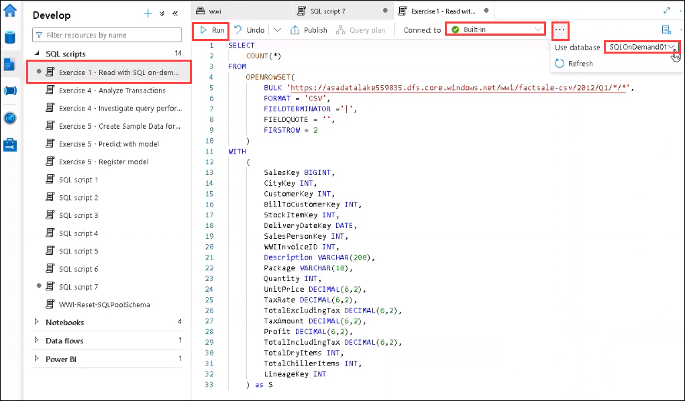

    > This query demonstrates the same functionality, except this time, it loads CSV files instead of Parquet ones (notice the `factsale-csv` folder in the path). Parquet files are compressed and store data in columnar format for efficient querying, as compared to CSV files which are raw representations of data, but easily processed by a large number of systems. Oftentimes, you can encounter many file types stored in a data lake and must know how to access and explore those files. When you access CSV files, for instance, you need to specify the format, field terminator, and other properties to let the query engine understand how to parse the data. In this case, we specify a value of `2` for FIRSTROW. This indicates that the first row of the file must be skipped because it contains the column header, for instance.
    >
    > Here we use WITH to define the columns in the files. You must use WITH when using a bulk rowset (OPENROWSET) in the FROM clause. Also, defining the columns enables you to select and filter the values within.

17. Replace the contents of the SQL script with this query, and **replace** `YOUR_DATALAKE_NAME` with your storage account name **<inject key="Storage Account Name"></inject>**. Select **Run** to execute the script. This query reads from Delta Lake format to calculate the 2012 quarterly sales quantity.

    ```sql
    SELECT 
     InvoiceYear,
     InvoiceQuarter,
     Sum(cast([Quantity] as int)) as SalesQuantity
    FROM
        OPENROWSET(
            BULK 'https://YOUR_DATALAKE_NAME.dfs.core.windows.net/wwi/factsale-deltalake',
     		FORMAT = 'DELTA'
        ) AS [result]
    WHERE InvoiceYear=2012
    GROUP BY
         InvoiceYear,
         InvoiceQuarter
    ```
    
    > Delta Lake is a popular format when using Apache Spark for analytics. The schema and partitions are automatically inferred when you reference a folder containing the Delta Lake structure. The ability to read this data from your serverless SQL pool means you do not need to switch to Spark to query data that was loaded and saved to Delta Lake by Apache Spark jobs.

18. Update the cell with the following statements to create an external table for the quarterly results. **Replace** `YOUR_DATALAKE_NAME` with your storage account name **<inject key="Storage Account Name"></inject>**. Select **Run** to execute the script.

    ```sql
    CREATE EXTERNAL DATA SOURCE WwiDataADLS
    WITH (LOCATION = 'abfss://wwi@YOUR_DATALAKE_NAME.dfs.core.windows.net') ;
    GO
    
    CREATE EXTERNAL FILE FORMAT CsvFormat
    WITH ( 
        FORMAT_TYPE = DELIMITEDTEXT, 
        FORMAT_OPTIONS ( FIELD_TERMINATOR = ',', STRING_DELIMITER = '"')
    );
    GO
    
    CREATE EXTERNAL TABLE QuarterlySales
    WITH (
        LOCATION = 'quarterly-sales',
        DATA_SOURCE = WwiDataADLS,
        FILE_FORMAT = CsvFormat
    )
    AS
    SELECT 
         InvoiceYear,
         InvoiceQuarter,
         Sum(cast([Quantity] as int)) as SalesQuantity
    FROM
        OPENROWSET(
            BULK 'https://YOUR_DATALAKE_NAME.dfs.core.windows.net/wwi/factsale-deltalake',
            FORMAT = 'DELTA'
        ) AS [result]
    WHERE InvoiceYear=2012
    GROUP BY
         InvoiceYear,
         InvoiceQuarter
    ```

    > This exports the results to CSV files in your data lake and defines a table schema that can be referenced directly in serverless SQL. You can test this by opening a **New Query** and running `SELECT * FROM QuarterlySales`. The results are now easy to query from an analytics tools such as Power BI or you can download the files from the Data Lake.

## Task 2 - Explore the data lake with Azure Synapse Spark

1. Navigate to the `Data` hub, browse to the data lake storage account folder `wwi/factsale-parquet/2012/Q1/InvoiceDateKey=2012-01-01`, then right-click the Parquet file and select `New notebook->Load to DataFrame`

   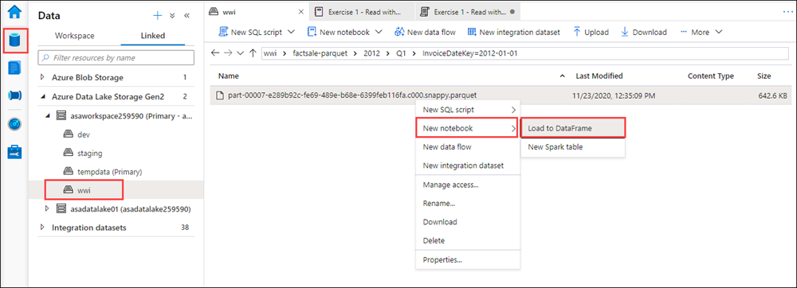

2. This will generate a notebook with PySpark code to load the data in a dataframe and display 10 rows with the header.

   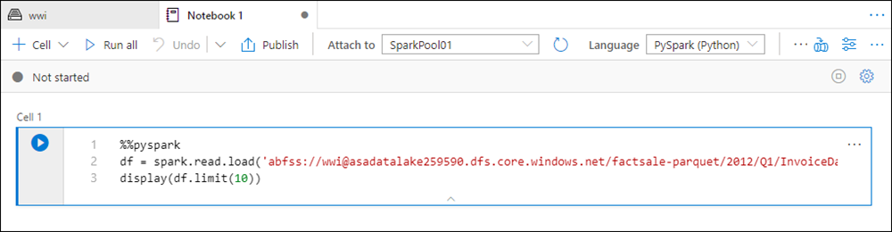
   

3. Attach the notebook to a Spark pool.

   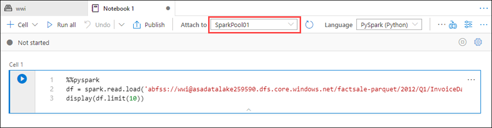

4. Select **Run all** on the notebook toolbar to execute the notebook.

   > **Note**: The first time you run a notebook in a Spark pool, Synapse creates a new session. This can take approximately 3 minutes.
   
   

5. As you can see, the output of the dataframe is displayed with 10 rows. To  display 100 rows with the header replace the last line of code with the following:

   ```python
   display(df.limit(100))
   ```

6. Rerun the notebook again to see the result.

   

7. Notice the included charting capabilities that enable visual exploration of your data. Switch to **Chart** view. Select **View Options** and change the **Key** to `CustomerKey` and **Values** to `CityKey` and then click on Apply button.

    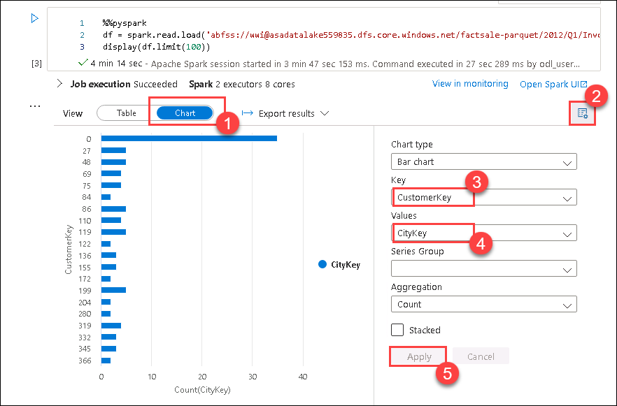
    
8. Hide the output as illustrated below.

    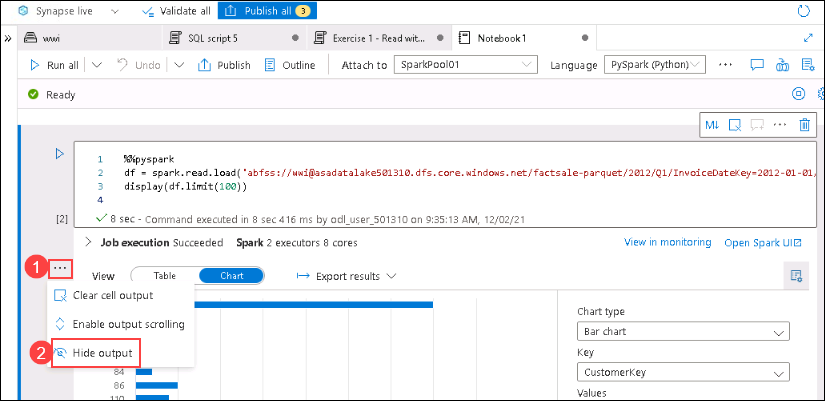

9. Hover over the area just below the cell in the notebook, then select **+ Code** to add a new cell. **+ Code** won't be visible until you Hover the area in front of arrow.

   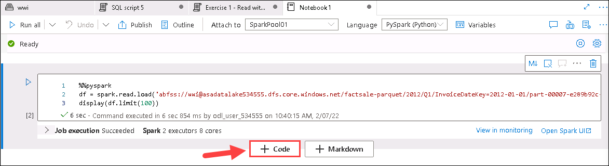

10. Paste the following into the cell and **replace** `YOUR_DATALAKE_NAME` with your storage account name **<inject key="Storage Account Name"></inject>**. You can also copy it from the first cell of the notebook above.

    ```python
    data_path = spark.read.load(
       'abfss://wwi@YOUR_DATALAKE_NAME.dfs.core.windows.net/factsale-csv/2012/Q1/*/*',
       format='csv',
       sep="|",
       header=True)

    display(data_path.limit(100))
    ```

11. Select the **Run cell** button to execute the new cell and then select the **Table** view in output section.

    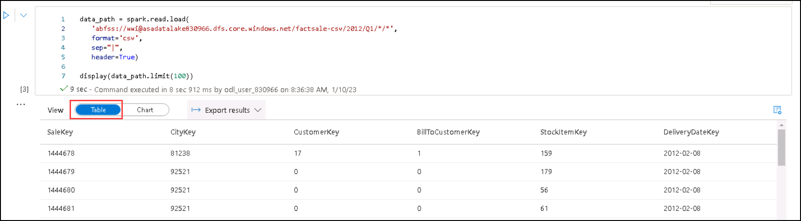

    > This notebook demonstrates the same functionality, except this time, it loads CSV files instead of Parquet ones (notice the `factsale-csv` folder in the path).

12. Add another cell and paste the following into the cell. Select the **Run cell** button to execute.This statement is setting configurations used by Apache Spark 3.0.

    ```python
    spark.conf.set("spark.sql.adaptive.enabled", "true")
    spark.conf.set("spark.sql.adaptive.coalescePartitions.enabled", "true")
    spark.conf.set("spark.sql.adaptive.coalescePartitions.minPartitionNum", 4)
    spark.conf.set("spark.sql.ansi.enabled", "true")
    ```

    > The Apache Spark pool for the lab is using Spark 3.0, which provides performance benefits over previous versions. These configurations enable Adaptive Query Execution and set how Spark should optimize partitioning during job execution. ANSI SQL is also enabled to check for data type errors and overflow errors.

13. Add another cell and paste in the SQL statement to read from a Delta Lake path. Replace `YOUR_DATALAKE_NAME` with your storage account name **<inject key="Storage Account Name"></inject>**. 
    ```sql
    %%sql
    SELECT 
        CityKey,
        SUM(Quantity) FILTER (WHERE CustomerKey != 0) as TotalQuantity,
        COUNT(DISTINCT StockItemKey) as UniqueItems
    FROM delta.`abfss://wwi@YOUR_DATALAKE_NAME.dfs.core.windows.net/factsale-deltalake`
    WHERE InvoiceYear=2012
        and InvoiceQuarter=1
    GROUP BY CityKey
    ORDER BY TotalQuantity desc
    LIMIT 10
    ```

    > Delta Lake is a popular format for storing data in a data lake since it supports upserts, deletes, and data versioning. You can access it using Spark SQL as shown here or by reading in as a DataFrame using `format(delta)`.

14. Select the **Run cell** button to execute. This uses the magic command `%%sql` to change language of the cell to Spark SQL. The SQL statement returns the top 10 cities based on total quantity.

    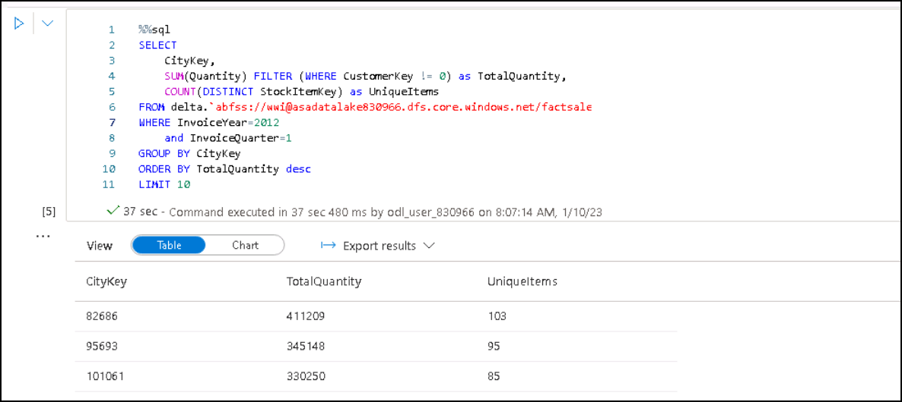

15. Notice the included charting capabilities that enable visual exploration of your data. Switch to **Chart** view. When running the same code with a larger dataset, Spark 3.0 can modify the query plan to be more efficient. In addition, you can enable autoscaling on your Apache Spark pool so it can automatically grow when the workload on the Spark pool increases.

    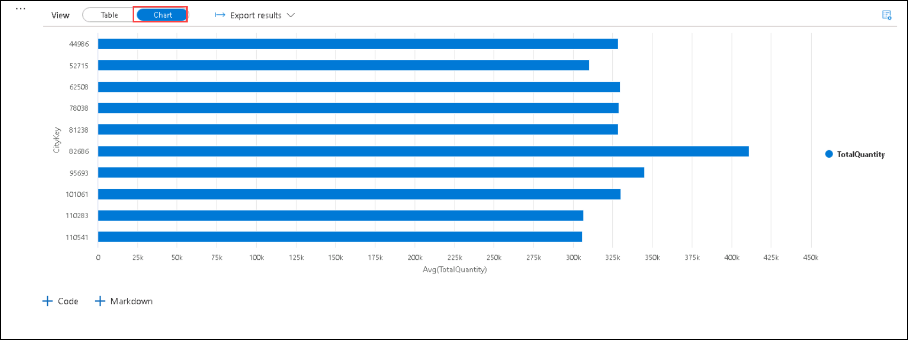

    > Without Adaptive Query Execution enabled, the group by and order by in this cell would result in over 400 tasks. Spark 3.0 has improved on these tuning options and introduced additional performance benefits which may be noticed when joining datasets and working with skewed data.

16. **Important**: If you are continuing to Exercise 2 now, _leave this notebook open for the first task_ of the next exercise. This way, you can continue to use this notebook and the running Spark session, saving you time.
