# Exercise 7 - Power BI integration

In this exercise, you will realize another benefit of the fully integrated environment provided by Azure Synapse Analytics. Here, you will create a Power BI Report and build a visualization within Synapse Analytics Studio. Once you have published a dataset, you will not have to leave this environment to log into a separate Power BI website to view and edit reports.

The Power BI Workspace has already been created for you.

The tasks you will perform in this exercise are:

- Exercise 7 - Power BI integration
  - Task 1 - Create a Power BI dataset in Synapse
  - Task 2 - Create a Power BI report in Synapse

---

**Important**:

In the tasks below, you will be asked to enter a unique identifier in several places. You can find your unique identifier by looking at the username you were provided for logging into the Azure portal. Your username is in the format `odl_user_UNIQUEID@msazurelabs.onmicrosoft.com`, where the _UNIQUEID_ component looks like `206184`, `206137`, or `205349`, as examples.

Please locate this value and note it for the steps below.

---

## Task 1 - Create a Power BI dataset in Synapse

In this task, you will use Power BI Desktop to create the dataset used by the report.

> Note: Power BI desktop will already be installed in the virtual machine provided with the lab.

1. Open Synapse Analytics Studio, and then navigate to the `Develop hub`.

   

2. Expand **Power BI**, expand the first node under it, and then select **Power BI datasets**.

   

   > The second node, named **PowerBIWorkspace<inject key="DeploymentID" enableCopy="false" />**, is the Power BI workspace added to your Synapse workspace as a linked service.

3. Select **New Power BI dataset** within the panel that appears.

   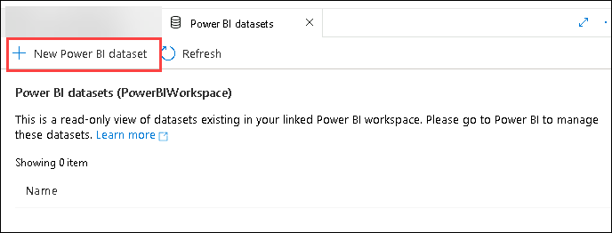

4. In the panel that appears, if a prompt appears to Install Power BI Desktop, select **Start**.

   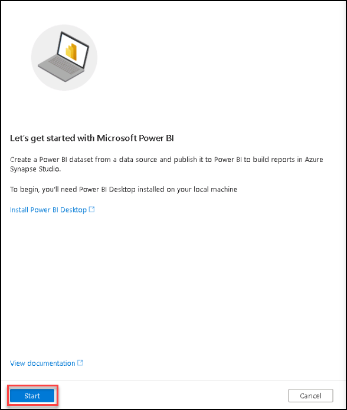

5. In the step by step dialog that appears, select `SQLPool01` and then select **Continue**.

   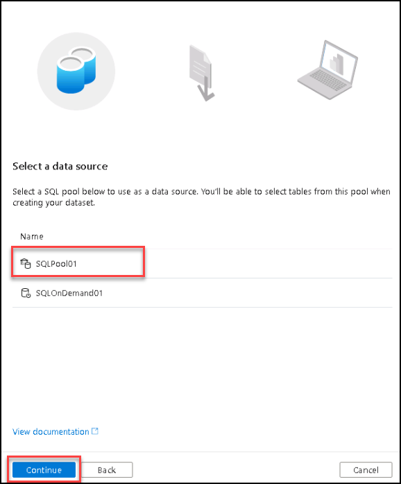

6. Select **Download** to download and save the suggested `pbids` file.

   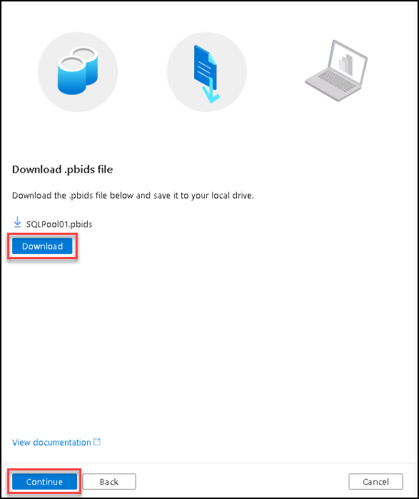

7. Open the downloaded .pbids file. This will launch the Power BI desktop.

   >PowerBI desktop will already be installed on the labvm provided.

8. When Power BI Desktop loads, select **Microsoft account**, then select **Sign in**. Follow the login prompts to log in with the credential provided to you. When you return to the SQL Server database dialog, select **Connect**.

   

9. In the Navigator dialog, within the list of tables select **wwi.FactSale**, confirm the preview shows some data, and then select **Load**.

   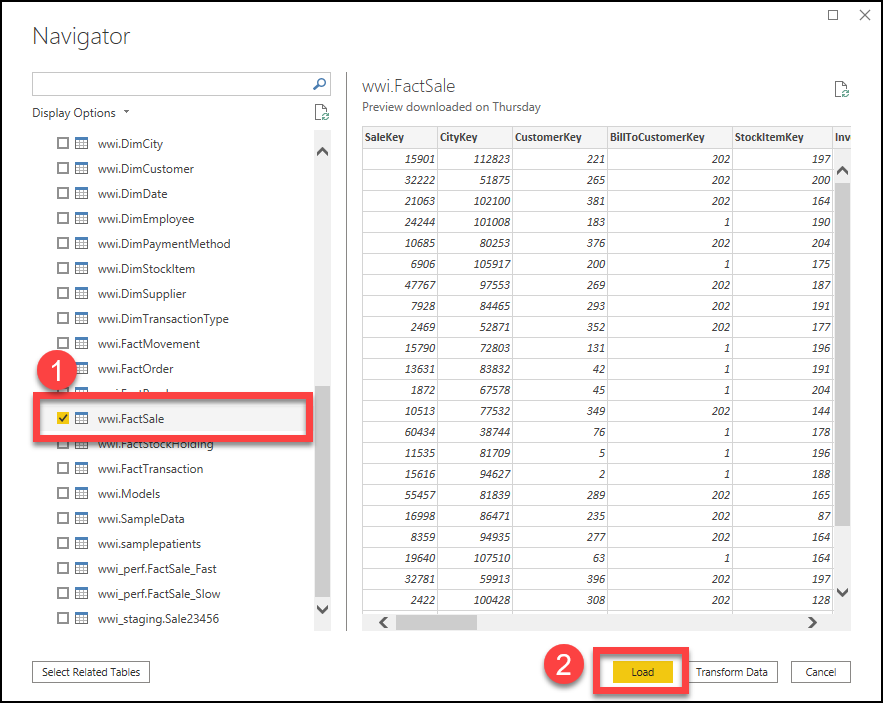

10. When prompted, set the query type to **Direct Query** and select **OK**.

    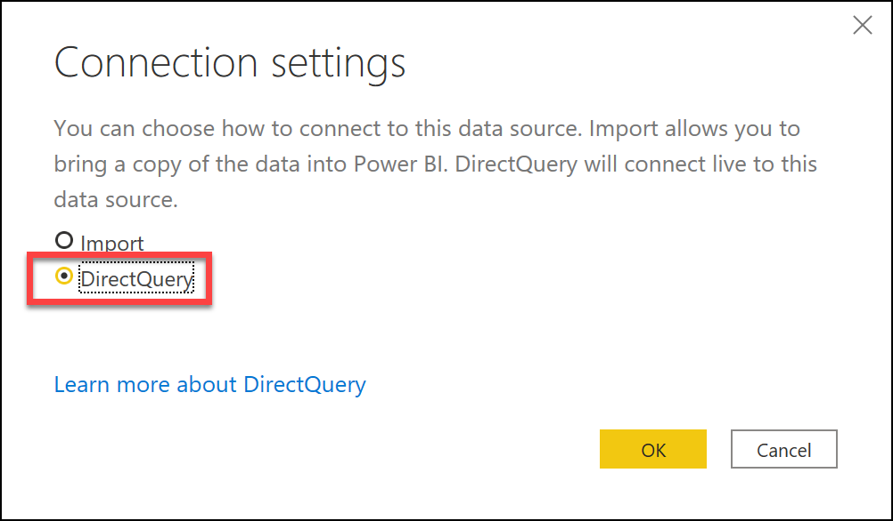

     >**Note**: If you have trouble connecting to the data source, open file explorer and right-click on the downloaded .pbids file, then select **Open with Power BI Desktop**.

11. From the **File** menu, select **Publish** and then select **Publish to Power BI**. If prompted to save your changes, select Save and provide `wwifactsales` as the name. This will also be the name used for the dataset. 

    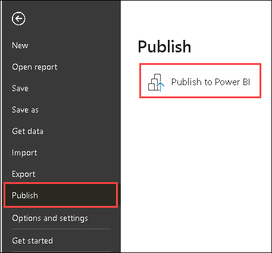
   
    >**Note:** You may be prompted to log in a second time. Follow the login prompts to log in with the credentials provided to you.

12. In the dialog that appears, select the provided Power BI workspace (the first one that appears under the `Power BI` section in the `Develop` hub). Do not select the item labeled My workspace. Choose **Select**.

    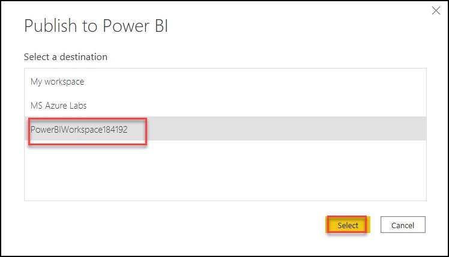

13. Wait until the publishing dialog shows a status of **Success**, then click **Got it** to close the dialog.

    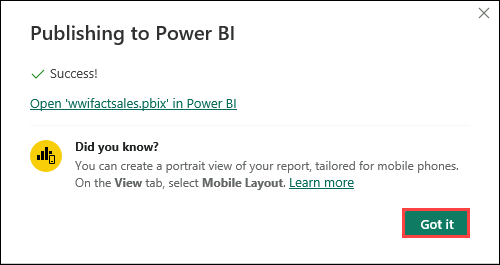

14. Return to your browser where you have Azure Synapse Studio open. Select **Close and refresh** in the New Power BI dataset dialog that should still be open.

    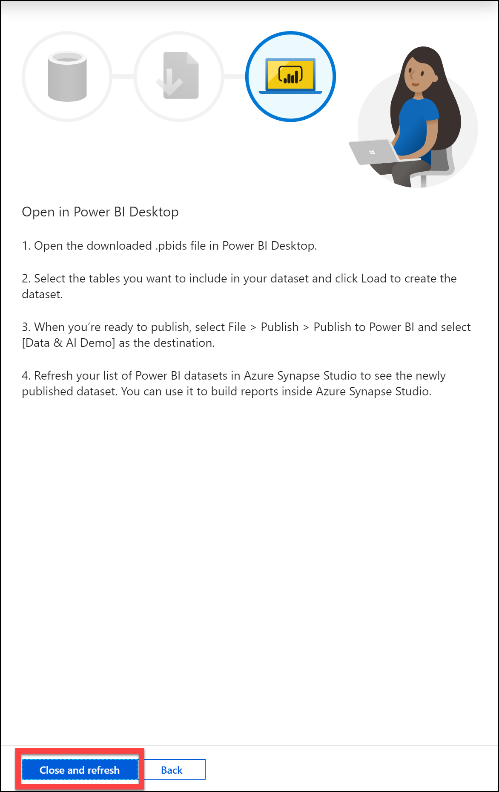

15. You should see your new Power BI dataset appear in the listing on the Power BI datasets panel. If not, select **Refresh**.

    

## Task 2 - Create a Power BI report in Synapse

In this task, you will learn how to use a collaborative approach to create a new Power BI report within Synapse Analytics Studio. To do this, you will use a dataset that was not created by you.

1. Select the `wwifactsales` dataset within the panel that appears. When you hover over the dataset, a button for creating a new Power BI report will appear. Select that button.

   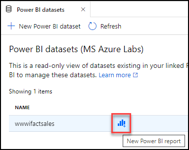

2. This will launch a new tabbed document with the Power BI report designer. Also note, that your new report appears under the Power BI reports folder in the `Develop` hub.

   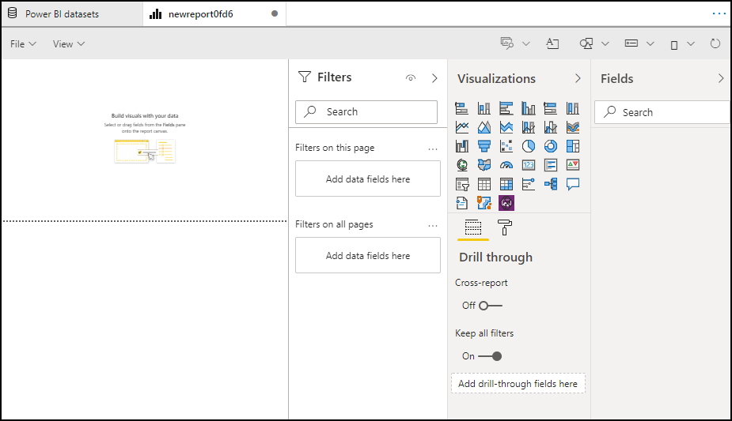

---

**Important**:

If you do not see a list of data fields under Fields, follow the steps below for a fix.

1. Navigate to [www.powerbi.com](https://www.powerbi.com) on a new browser tab. Select **Sign In** and use the credential provided to you.

2. Select `Workspaces` from the left menu and select `PowerBIWorkspace` as shown in the screenshot.

   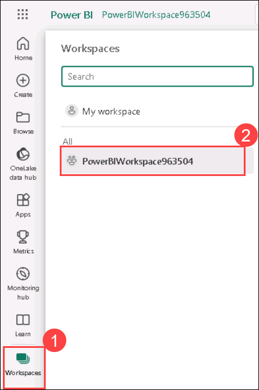

3. Navigate to the **Settings** by selecting the ellipse symbol at the top right, then select **Power BI Settings** from the menu.

   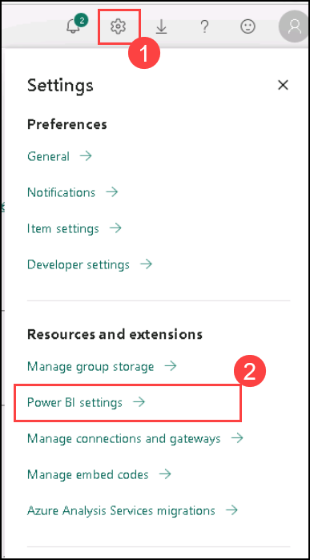

4. Select the **Datasets** tab. From the list of datasets select `wwifactsales`, then select **Edit credentials** underneath the **Data Source credentials** section.

   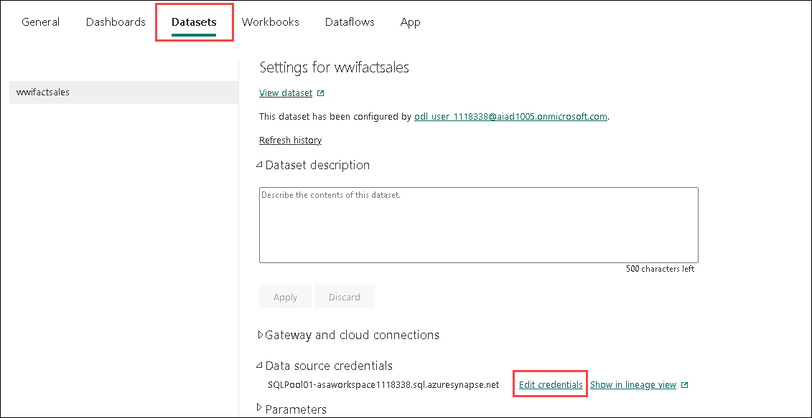

5. Under **Authentication Method** select `OAuth2` and select **Sign In**.

   

6. Navigate back to your Synapse workspace in the previous tab and select the **refresh** button above the Fields list in the Power BI report. After a few seconds, you should see the list of fields below. Alternatively, you may refresh your browser window.

   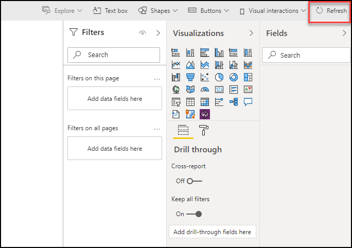

7. Within the Power BI Designer, select **Table** under Visualizations.

   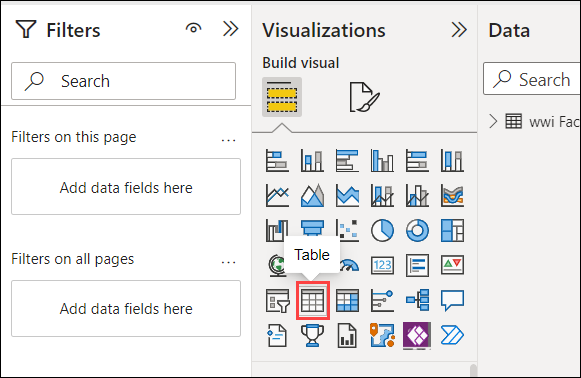

8. Drag the **Profit**, **SalespersonKey** and **TotalExcludingTax**,  field into **Cloumns** field for the visualization. 

   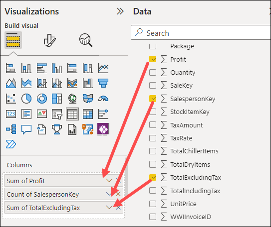
   
9. Click on the downward arrow button next to each field in **Columns** section and select **Don't summarize**.

   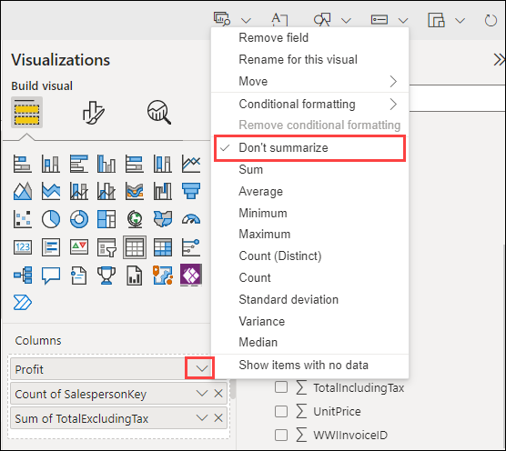
   
     >**Note**: Make sure to select **Don't summarize** aggregation for all the three fields.

10. Resize the line and clustered column chart visualization to fit the report area. Your visualization should look like the following:

     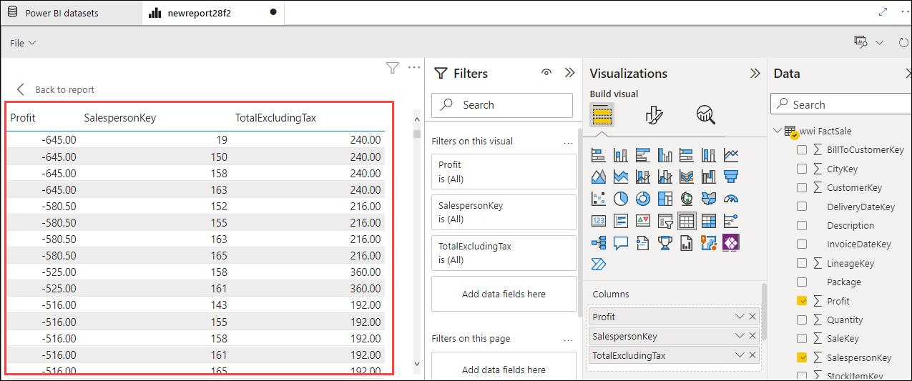

11. Under the **Filters** pane, expand the **Profit** filter **(1)**. Select **is greater than** under `Show items when the value:` **(2)**, then enter **5000** for the value. Select **Apply filter (3)**.

    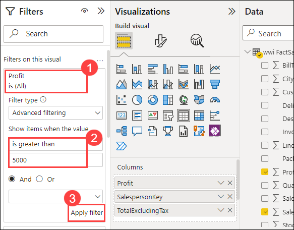

12. After a few seconds, you should see the visualization change based on the filter. In this case, we narrow down the results to only those where the total profit amount is greater than 5000. Since we are using Direct Query, Power BI pushed down the filter to the dedicated SQL pool (SQLPool01) to execute a new query based on the filter parameters. The pool sent back the results to Power BI to re-render the chart. Since we are dealing with a vast number of records (over 12 million), harnessing the dedicated SQL pool's power to aggregate and filter the data rather than importing them and using the Power BI engine to do the work is much more efficient.

    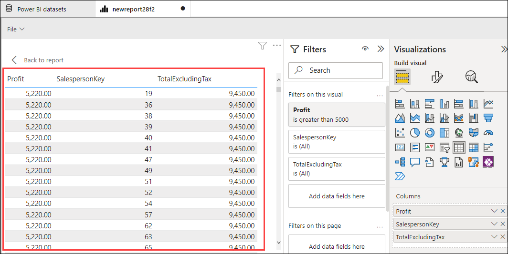

13. From the file menu within the designer, select **Save As**.

    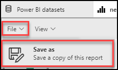

14. In the dialog that appears, enter **Key Sales by Person** for the name, then select **Save**.

    

15. This report is now available to all authorized users within Synapse Analytics Studio and the Power BI workspace.

## Task 3 - View the SQL query

1. Navigate to the **Monitor** hub.

   

2. Select **SQL requests** in the left-hand menu **(1)**, then select **SQLPool01** under the Pool filter **(2)**. Look at the list of recent queries executed by your lab username as the Submitter. Hover over one of these queries to see the **Request content**, and click on **More** next to the Request content **(3)** to view the executed query.

   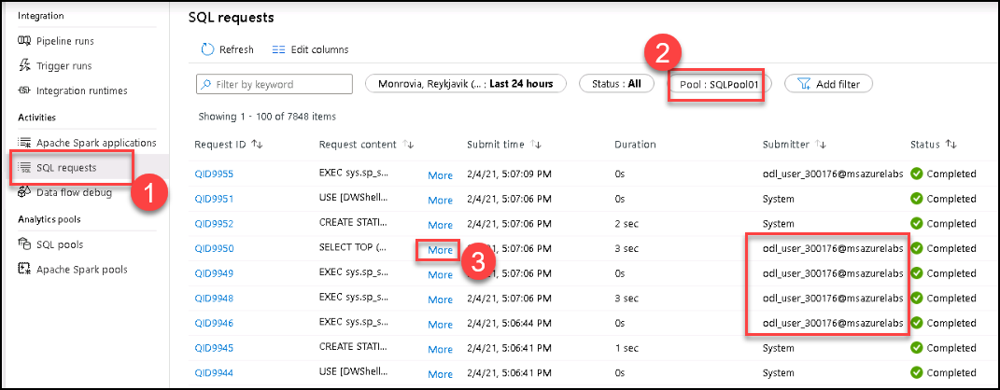

3. View the queries' request content until you find one that contains the SQL SELECT statement executed by your filter in the Power BI report. Here you can see the `Profit`, `SalespersonKey`, and `TotalExcludingTax` fields have been selected from the `wwi.FactSale`. A WHERE clause filters the rows where the value is greater than or equal to `5000`. Power BI generated the SQL script, then used the dedicated SQL pool to execute the query and send back the results.

   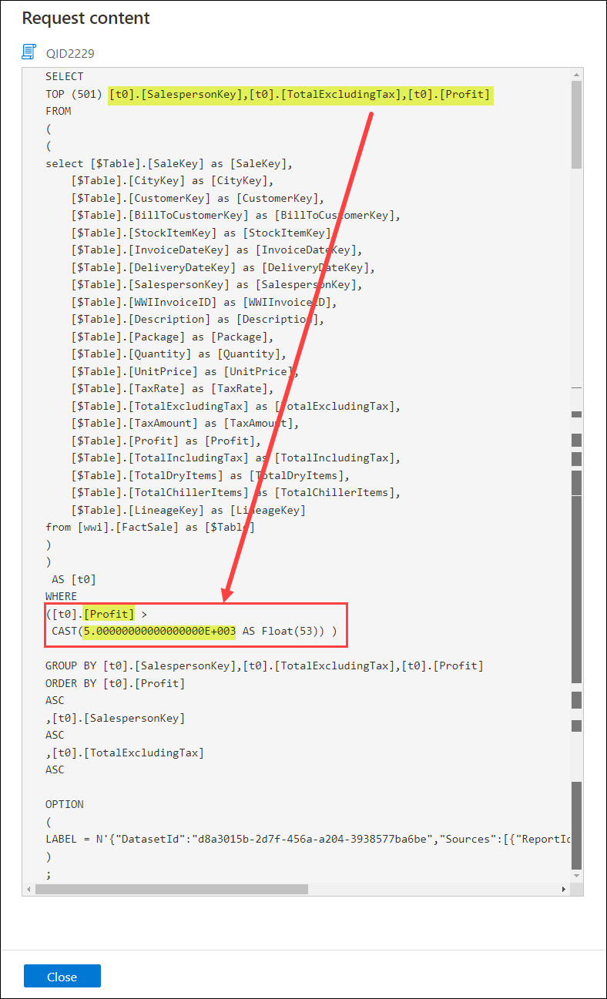

   ## Proceed to execise 8
