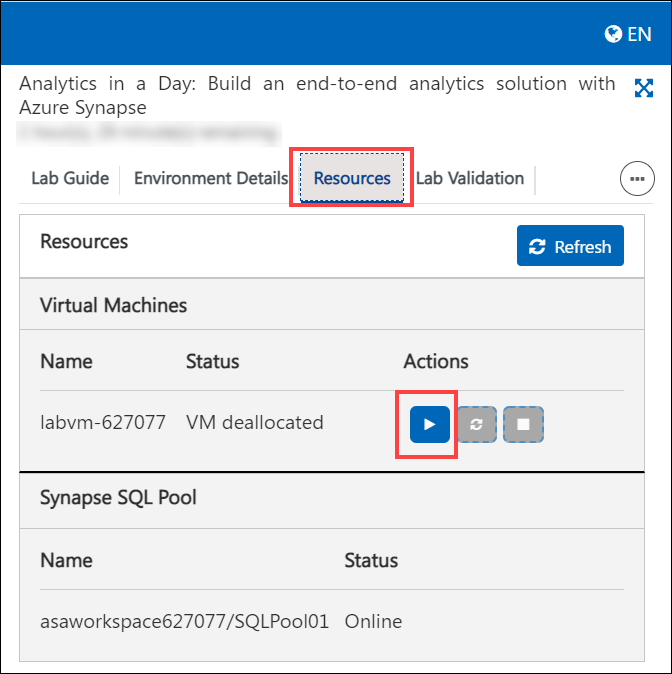

# Hands-On-Lab: Create and publish PowerBI Dashboards & Reports

### How to get started with a provided lab environment

If you are using a hosted lab environment, please follow the steps below to get started:

1. Select the **Lab Environment** tab above the lab guide to copy the Azure credentials used for the lab. Make note of the `UniqueId` value. This value may be referenced at different points during the lab.

    

2. Select **Resources** tab to start the Virtual Machine (VM) provided for this lab. However, you do not need to use the VM to complete the lab. It is there for your convenience to make it easier to sign into Azure if you have an existing account and do not want to log out of it.

    

##  Create and publish PowerBI Dashboards & Reports

In this exercise, you will build a Power BI report in Azure Synapse Analytics.

The visual approach in data exploration, analysis, and interpretation is one of the essential tools for both technical users (data engineers, data scientists) and business users. Having a highly flexible and performant data presentation layer is a must for any modern data platform.

Azure Synapse Analytics integrates natively with Power BI, a proven and highly successful data presentation and exploration platform. The Power BI experience is available inside Synapse Studio.

